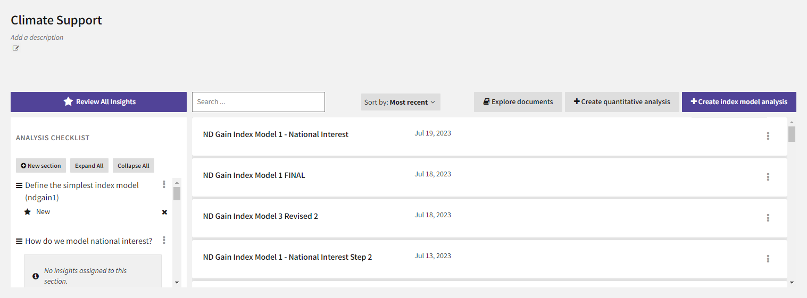
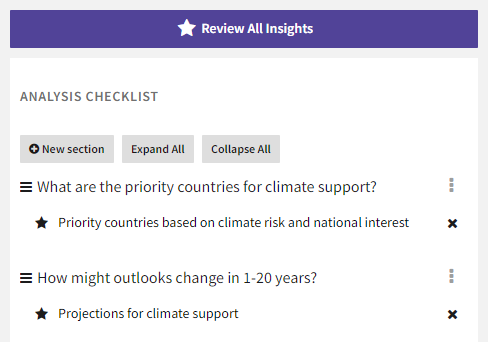

An analysis project is a workspace for building, collaborating on, and sharing a collection of related qualitative and quantitative analyses. You can save the state of any analysis as an "insight" that you can share or use as a bookmark to jump back into your workflow.

??? list "To create an analysis project"

    1. On the home page, click **New Analysis Project**.
    2. In the **Name** field, enter a unique name for your project.
    3. Click **Save & Finish**.

## Plan an analysis

Each analysis project has an analysis checklist that helps you capture the questions and lines of inquiry you want to address. You can use the checklist to:

- Record your hypotheses.
- Plan your analysis.
- Collaborate with other analysts.
- Organize your findings.
- Review progress.

As you build your analyses, you can attach evidence to each section of the checklist in the form of bookmarked [insights](insights.md) that capture the state of the analysis.

??? list "To build an analysis checklist"

    1. Click :fontawesome-solid-circle-plus:{ aria-hidden="true"} **New section**.
    2. Give a name to the section by entering a hypothesis, question, or line of inquiry and click **Save**.
    3. To move a section, click :fontawesome-solid-bars:{ alt="Move" title="Move" } next to its name and drag it above or below another section. When a purple line appears in the space, release the selected section.

??? list "To edit or delete sections in the checklist"

    + Click :fontawesome-solid-ellipsis-vertical:{ alt="Options" title="Options" } and then select:
        * :fontawesome-solid-pen-to-square:{ aria-hidden="true"} **Edit** to change the name of the section.
        * :fontawesome-solid-trash-can:{ aria-hidden="true"} **Delete** to remove the section.
    
            ??? info "Insights in deleted sections"
    
                Insights are never deleted when you delete a section. To find insights that were listed in a deleted section, click :fontawesome-solid-star:{ aria-hidden="true"} **Review All Insights**.

??? list "To add insights to a section"

    + To add existing insights, perform the following actions: 
        1. Click :fontawesome-solid-star:{ aria-hidden="true"} **Review All Insights**.
        2. Find the insight you want to add and click :fontawesome-solid-ellipsis:{ alt="Options" title="Options" } > :fontawesome-solid-pen-to-square:{ aria-hidden="true"} **Edit**.
        3. In the **Add to Analysis Checklist section** list, select the section to which you want to add the insight.
    + To add new insights, see [Insights](insights.md).

## Create an analysis

A project can contain any number of related [data-driven index models](index-graph.md). With each analysis you can:

- Represent a complex system as a set of concepts back by evidence from scientific literature and high-fidelity datasets.
- Visualize cascading effects of change from different scenarios. 

??? list "To create a new analysis"

    1. Click :fontawesome-solid-plus:{ aria-hidden="true"} **Create Index**.
    2. To rename the analysis, click :fontawesome-solid-pencil:{ alt="Options" title="Options" } > :fontawesome-regular-pen-to-square:{ aria-hidden="true"} **Rename** in the nav bar, enter a unique name, and then click **Confirm**.