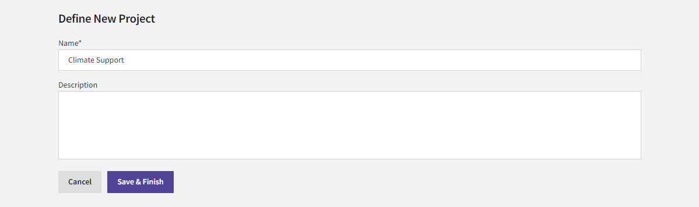

This example shows how to use Causemos to create, build out, and share findings from an analysis project. It assumes you're an analyst trying to decide in which countries your government should focus resources to mitigate the effects of climate-driven events.

??? note "Available data and documents"

     This example examines Causemos in the context of climate and national security interests. 

     Your organization has configured Causemos to help you explore and understand systems in your domain of expertise. Instead of the data and documents shown in this example, you have access to a collection curated by your organization. 

In this workflow, you will:

1. Create a new project.
2. Make an analysis checklist.
3. Create a new analysis graph.
4. Rank regions according to the need for climate support.
5. View projections of key concepts in the graph.
6. Save and share insights that you've uncovered.

## Create a new project

A [project](analysis-projects.md) is your space to capture questions and lines of inquiry, build analyses and scenarios to try to understand the system, and save and share your findings.



This example shows how to create a `Climate Support` project that has a single analysis. A project can, however, contain many analyses used to understand aspects of or scenarios related to the underlying system. 

<p class="procedure">To create a new project</p>

1. On the home page, click **New Analysis Project**.
2. In the **Name** field, enter `Climate Support`.
3. Click **Save & Finish**.

## Make an analysis checklist

The first thing you'll often do in a project is create an [analysis checklist](analysis-projects.md#plan-an-analysis) where you can capture lines of inquiry and planned analyses. For the exploration of climate support, you might want to answer:

- What are the priority countries for climate support?
- How might outlooks change in 1&ndash;20 years?

You can add each of these questions to the project's checklist and then later&mdash;when you've finished your analysis&mdash;attach findings or evidence to them.


<p class="procedure">To make an analysis checklist</p>

1. Click :fontawesome-solid-circle-plus:{ aria-hidden="true"} **New section**.
2. In the text box, enter a section title of:
    ```text
    What are the priority countries for climate support?
    ```
3. Repeat steps 1&ndash;2 to add another section titled: 
    ```text
    How might outlooks change in 1-20 years?
    ```

## Create a new analysis graph

Now you can build a simple data-driven index model to explore the question about priority countries. Drawing from your domain knowledge, you want to see how global climate risk and your country's national interest drive country rankings. 

The new analysis starts with an overall priority concept, which in this case represents a ranking of countries to support. You'll build your model from right to left, first attaching national interest and climate risk concepts.

<figure markdown>
  
  <figcaption>
    <p>The climate support index model weighs both national interest equally at 50%. The two index models that feed into climate risk thus contribute 25% to the overall priority.</p>
    <p>Edges between concepts show the polarity of the relationship. <span class="polarity-same">Blue</span> indicates the child concept has the same polarity as the parent, while <span class="polarity-opposite">orange</span> indicates the opposite polarity.</p>
  </figcaption>
</figure>

Next, you'll associate these concepts with their own supporting and refuting child concepts with a set of drivers backed by index models. To help you find drivers and data, Causemos will use LLMs to suggest concepts and datasets relevant to your input.

<p class="procedure">To create a new analysis graph</p>

1. Click :fontawesome-solid-plus:{ aria-hidden="true"} **Create index model analysis**.
2. Rename the overall priority node to align with your goal: 
    1. Hover over the node and click :fontawesome-solid-ellipsis-vertical:{ alt="Options" title="Options" } > :fontawesome-solid-pencil:{ aria-hidden="true" } **Rename**.
    2. Delete the existing text, enter `Priority Countries for Climate Support` and click **Done**.
3. Click **Add input concept**, type `National Interest` in the text box, and press ++enter++.

    ??? tip "Suggested drivers"

        When you choose to add an input concept, Causemos automatically suggests a list of concepts that drive the parent concept. You can filter these suggestions by clicking :fontawesome-solid-earth-americas:{ aria-hidden="true"} **Add geographic context** and entering a region of interest. To add a suggestion to your graph, click it.

4. Repeat step 3, this time naming the new node `Climate Risk`.
5. Add the following concepts as inputs to the concepts added in the previous steps. After you type the name of each concept, select the corresponding dataset from the list of suggested datasets.
    <table>
      <thead>
        <tr>
          <th>Parent concept</th>
          <th>Input concept</th>
          <th>Dataset</th>
        <tr>
      </thead>
      <tbody>
        <tr>
          <td>National Interest</td>
          <td>Natural Resources</td>
          <td>Total natural resources rents (% of GDP)</td>
        </tr>
        <tr>
          <td rowspan="2">Climate Risk</td>
          <td>Adaptive Capacity</td>
          <td>Capacity Indicator</td>
        </tr>
        <tr>
          <td>Climate Vulnerability</td>
          <td>Vulnerability Indicator</td>
        </tr>
      </tbody>
    </table>
6. To adjust the polarity of the Adaptive Capacity node:
    1. Click the edge between it and its parent.
    2. In the details pane, click the dropdown list in the statement <i>High Adaptive Capacity represents **high** Climate Risk values</i> and then select **low**.

## Rank regions according to the need for climate support

When you've completed your graph, the weighted sum of the attached datasets flows up your index structure to calculate region rankings for your overall priority. You'll explore these rankings on a map and drill down into the index weights to understand why each country is ranked where it is.


Because these rankings answer the first question in your analysis checklist, you can save the results for future reference.

<p class="procedure">To see region rankings for your index graph</p>

1. On the Priority Countries for Climate Support node, click **See results**.
2. Review the Dataset weights to understand how each concept contributes to the overall rankings.
3. To understand what drives individual country rankings, click **Show key datasets for each country**.
4. To see which countries aren't ranked due to missing data, click **Review hidden countries**.
5. To save the rankings: 
    1. Click :fontawesome-solid-star:{ aria-hidden="true"} **Insights** > **Save new insight**.
    2. Click **Add to Analysis Checklist section** and select *What are the priority countries for climate support?*.
    3. Type a unique insight name such as *Priority countries based on climate risk and national interest* and then click **Done**.

## View projections of key concepts

The projections space lets you view recent and future trends in the index models and concepts in your graph. You can use the projections to compare the trends across different countries or across custom scenarios you've defined with specific constraints on different concepts.


Like you did in the ranking space, you'll save an insight here to serve as a reference for your second analysis checklist question.

<p class="procedure">To view projections of key concepts</p>

1. Click **View projections**.
2. Use the settings to choose the countries you want to analyze.

    ??? note "Comparing scenarios"

        You can only compare different scenarios when you are viewing projections for a single country. Scenario comparison is not available when viewing projections for multiple countries.

4. Change the time range to cover the dates you're interested in:
    1. Click **Edit**.
    2. Change the **to** date to *December 2030*.
3. To create a new scenario and compare it to the default with no constraints:
    1. Click :fontawesome-solid-plus:{ aria-hidden="true"} **Create new scenario**.
    2. Type a unique name for the scenario.
    3. Click a node you want to add a constraint to.
    4. Click anywhere on the projection graph to add a constraint. Click directly above or below an existing data point to replace it with a constraint. To remove a constraint, click it again.
    5. Click **Done**.
5. To save the projections: 
    1. Click :fontawesome-solid-star:{ aria-hidden="true"} **Insights** > **Save new insight**.
    2. Click **Add to Analysis Checklist section** and select *How might outlooks change in 1-20 years?*.
    3. Type a unique insight name such as *Projections for climate support* and then click **Done**.

## Save and share insights

When you're done with your analysis, you can review your insights, use them to jump back into your workflow at any time, or share them with collaborators.


<p class="procedure">To save and share insights</p>

1. Click :fontawesome-solid-star:{ aria-hidden="true"} **Insights** > **View all**.
2. Select the insights you want to share.
3. In the upper right corner, click **PowerPoint** or **Word** to choose how you want to save and share the insights.