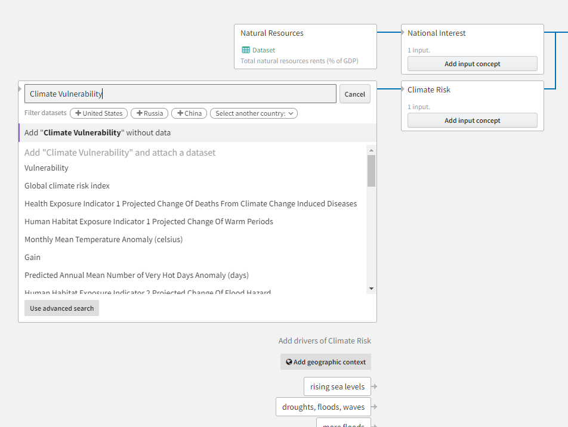
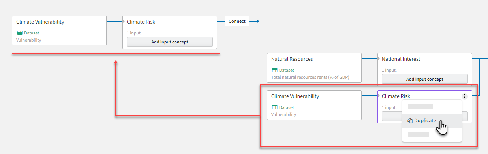

The index graph is a space for you to represent your analysis as a tree-like hierarchical structure with:

- Your [overall priority](#overall-priority)&mdash;the problem or question you're trying to answer&mdash;on the right.
- Many layers of input [concepts and datasets](#concepts-and-datasets) branching out of it to the left.
- [Edges](#edges) that show the direction of the relationships between the interconnected overall priority, concepts, and datasets.


As you build out your analysis, you'll work right to left to fully map out the system you're trying to understand. To help you build your mental model, Causemos uses a causal recommender to suggest relevant datasets and concepts.

## Set the overall priority

The node that represents your overall priority is the rightmost node in the graph. All datasets and concepts you attach as inputs contribute to its rankings and projection.


You can rename the node to align with your analytical goals.

??? list "To rename the overall priority node"

    1. Hover over the node and click :fontawesome-solid-ellipsis-vertical:{ alt="Options" title="Options" } > :fontawesome-solid-pencil:{ aria-hidden="true" } **Rename**.
    2. Edit the name and press ++enter++.

## Add concepts and datasets

Concepts represent factors that contribute to your overall priority. You can quantify a concept by: 

- Attaching a dataset to it, or 
- Attach one or more child concepts linked to other concepts or datasets.

<figure markdown>
  
  <figcaption>Two concepts, National Interest and Climate Risk, (right) with no data attached to them. Instead they have child concepts that can be attached to datasets or added without data. As you add input concepts, relevant datasets and drivers are automatically suggested.</figcaption>
</figure>

To help you build your analysis faster and find unknown connections, Causemos automatically suggests relevant drivers and datasets as you add new concepts.

??? info "How Causemos suggestions work"

    Causemos uses open source large language models (LLMs) to enhance your searches with dataset and "driver" concept suggestions.

    ### Dataset search

    Causemos does both a keyword search (using the terms you enter) and a semantic search (finding terms related to your input). LLMs enable semantic search by computing vector representations of the available dataset feature descriptions and then comparing them to a vectorized version of your query.

    For example, if you search for "rainfall", you also get results related to "precipitation" because the system recognizes that the two terms are synonymous.
    
    ### Drivers

    To find factors that drive a selected concept, Causemos uses an LLM fine-tuned on the available documents to create a domain-specific causal recommendation system. 

    Causemos poses the following prompt to the LLM, replacing **&lt;topic&gt;** with the name of the selected concept. The final `1.` in the prompt encourages the model to continue using the provided format.

    ```
    General knowledge test. Please answer the following questions with single words or short phrases:

    what are 3 causes of famine in America?
    1. income inequality
    2. lack of affordable housing
    3. systemic racism
    
    what are 3 effects of solar flares?
    1. power outages
    2. radio interference
    3. auroras
    
    what are 3 causes of <topic>?
    1.
    ```

    For example, if you choose to add input concepts to "Climate Risk", the prompt gets the LLM to suggest driver concepts such as "global warming", "deforestation", and "resource depletion".

??? list "To add an input concept"

    1. Click **Add input concept** on the overall priority or the concept you want to attach it to.
    2. Enter your keywords in the **Type a concept** field on the new node.
    3. Choose whether to associate a dataset with the the concept:
        - To add the concept without data, press ++enter++.
        - To add the concept with data:
            1. Review the suggested datasets below your keywords by hovering over them to see preview of their contents. 
            2. To filter the datasets by the regions they cover, click one of the suggested countries (such as :fontawesome-solid-circle-plus:{ aria-hidden="true"} **United States**) in the Filter datasets section or click **Select another country** to choose a different country.
            3. Click a dataset name to add it to the concept.

??? list "To add an unconnected concept"

    1. Click **Add concept**.
    2. Enter your keywords in the **Type a concept** field on the new node.
    3. Choose whether to associate a dataset with the the concept:
        - To add the concept without data, press ++enter++.
        - To add the concept with data:
            1. Review the suggested datasets below your keywords by hovering over them to see preview of their contents. 
            2. To filter the datasets by the regions they cover, click one of the suggested countries (such as :fontawesome-solid-circle-plus:{ aria-hidden="true"} **United States**) in the Filter datasets section or click **Select another country** to choose a different country.
            3. Click a dataset name to add it to the concept.
    4. To connect the concept, click **Connect** and then click another concept (or the overall priority) anywhere in the graph.

??? list "To attach a dataset to a concept"

    1. Click :fontawesome-solid-table-cells:{ aria-hidden="true" } **Attach dataset**.
    2. Enter your keywords in the **Type a concept** field on the new node.
    3. Choose whether to associate a dataset with the the concept:
        - To add the concept without data, press ++enter++.
        - To add the concept with data:
            1. Review the suggested datasets below your keywords by hovering over them to see preview of their contents. 
            2. To filter the datasets by the regions they cover, click one of the suggested countries (such as :fontawesome-solid-circle-plus:{ aria-hidden="true"} **United States**) in the Filter datasets section or click **Select another country** to choose a different country.
            3. Click a dataset name to add it to the concept.

??? list "To find a dataset not listed in the suggestions"

    1. Click **Use advanced search**.
    2. Use the search bar or the datacube facets to narrow down the list of available datasets.
    3. Click :fontawesome-regular-circle:{ alt="Select" title="Select" } on a dataset to select it, and then click :fontawesome-solid-circle-plus:{ aria-hidden="true"} **Add Dataset**.

??? list "To find concepts that drive a selected concept"

    1. Click **Add input concept** on the overall priority or the input concept you want to attach it to.
    2. Wait for the causal recommender to suggest a list of drivers below the new node. When the recommendations are ready, click :fontawesome-solid-earth-americas:{ aria-hidden="true"} **Add geographic context** to filter them by region of interest. 
    3. Click each driver you want to add.
    4. To add dataset to a driver, click :fontawesome-solid-table-cells:{ aria-hidden="true" } **Attach dataset**.
    5. When you're done adding the recommended concepts, click **Cancel** to close the Add concept node.

### Duplicate a concept or concept branch

You can duplicate any concept in your graph. Duplicating a node also duplicates its children.

<figure markdown>
  
  <figcaption>Duplicating a concept also duplicates any child concepts attached to it.</figcaption>
</figure>

Using duplication, you can effectively cut and paste concepts or whole branches of your graph. Just delete the original concept after you've connected its duplicate.

??? list "To duplicate a concept or concept branch"

    1. Hover over the node and click :fontawesome-solid-ellipsis-vertical:{ alt="Options" title="Options" } > :material-content-copy:{ aria-hidden="true" } **Duplicate**.
    2. To connect the concept, click **Connect** and then click another concept (or the overall priority) anywhere in the graph.
    3. (Optional) Hover over the original concept and click :fontawesome-solid-ellipsis-vertical:{ alt="Options" title="Options" } > :fontawesome-solid-trash-can:{ aria-hidden="true" } **Delete**

### Understand concept weights

The [ranking](#projections) for a concept with a dataset draws on the dataset itself. The ranking for a concept with one or more child concepts is a weighted sum of its children. Each child concept has the same weight as each of its siblings. 

<figure markdown>
  
  <figcaption>The overall priority weighs both National Interest and Climate Risk at 50%. Climate Risk's two components (Climate Vulnerability and Adaptive Capacity) thus contribute 25% each to the overall priority results.</figcaption>
</figure>

### Invert a dataset

Sometimes you may use a dataset as a proxy for a concept in your graph. For example, if you're trying to model income, you many find that a poverty dataset best fits the concept, albeit inversely. In this case, you can invert the poverty dataset to better represent income.

<figure markdown>
  
  <figcaption>Poverty dataset attached to an income concept. The poverty dataset is inverted to indicate that high levels of poverty represent low income.</figcaption>
</figure>

??? list "To invert a dataset"

    1. Click the dataset node to open the details panel.
    2. Click the dropdown list in the statement <i>High [dataset name] represents **high** [concept name] values</i> and then select **low**.

## Adjust edge polarities

Edges between concept nodes show the polarity of their relationship. By default, all concepts you create have a polarity that shows they cause high levels of the concept to which you attach them. You can switch the polarity at any time to show that the selected concept instead causes low levels.


??? list "To change the polarity of an edge"

    1. Click the edge to select it.
    2. In the side panel, use the dropdown list in the statement <Left node> represents **high/low** <right node> values.

## Document snippets

More detail about each concept in the analysis graph is available in the side panel. The document snippets section shows passages from the available documents that relate to the title of the selected concept (or concepts connected to the selected edge) in a geographic area of interest. 


You can use the snippets to help expand or revise your mental model by:

- Drilling down into the source documents, 
- Confirming the relationship between concepts, and 
- Learning more about the system.

??? list "To view document snippets"

    1. Click a concept or edge to open the side panel.
    2. Scroll down to the Document snippets section and review the summaries. <span class="highlighted">Highlighted portions</span> match or are semantically similar to the titles of the selected concepts and the geographic context.
    3. Click :fontawesome-solid-earth-americas:{ aria-hidden="true"} **Add geographic context** to filter the snippets by region of interest.
    4. To view an entire document, click **View in context**.