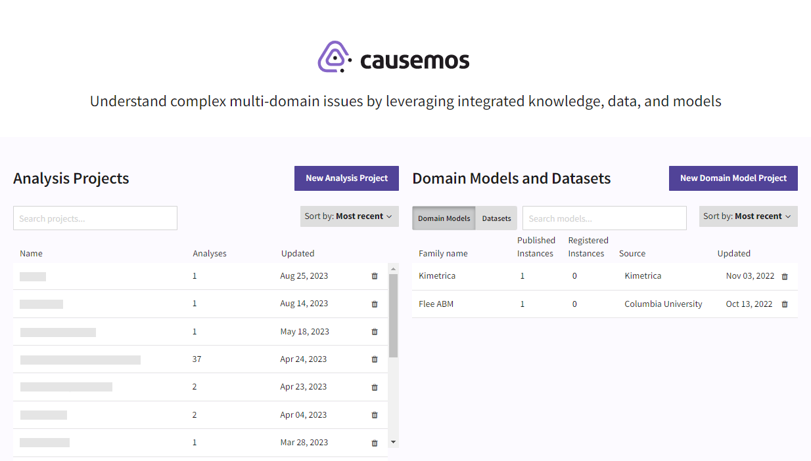

Causemos is an analytical platform for modeling complex, dynamic systems in order to inform policy and interventions. With Causemos, you can combine qualitative analyses and documents with quantitative models and data to:

- Explore and expand expert-created index models,
- Perform sophisticated simulations, and 
- Synthesize knowledge from vast document and data collections.

As you use Causemos to build analysis graphs of complex systems, you can:

- Augment your graphs with system-generated concepts based on evidence from uploaded scientific literature and data from high fidelity datasets.
- Visualize the cascading effects of change from different scenarios.
- Tailor analysis and interventions to actual sources.

Need help? Check out these topics:

[Get started](get-started.md){ .md-button }
[Create an analysis project](analysis-projects.md){ .md-button }

[Build an index graph](index-graph.md){ .md-button }
[Rank regions](rank-regions.md){ .md-button }

[View projections](projections.md){ .md-button }
[Save and share insights](insights.md){ .md-button }

