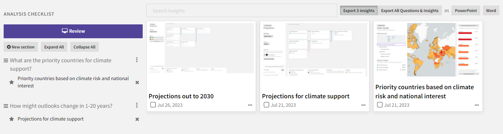
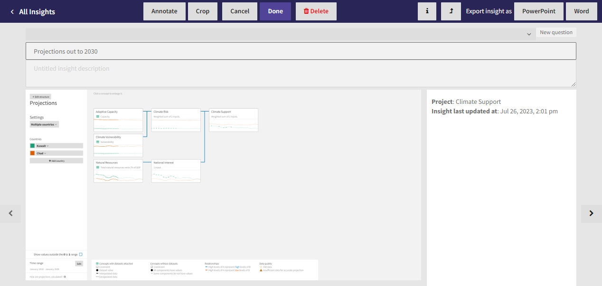
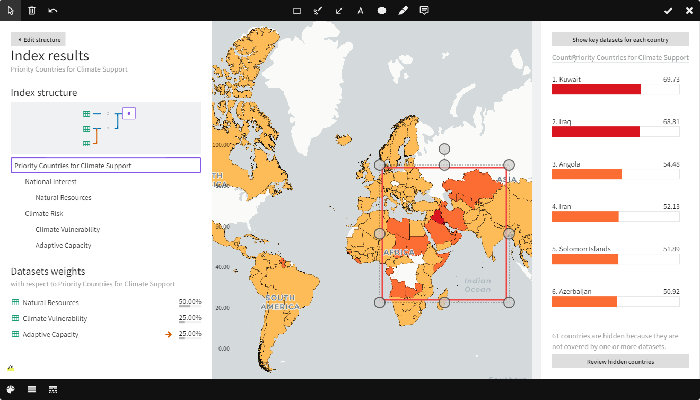

Insights are snapshots of and links back to different states of your analyses. You can capture them to: 

- Save "evidence" for your hypotheses in your analysis checklist.
- Jump back into your work.
- Share your findings with others.

??? list "To open the Saved Insights page"

    - In any analysis space, click :fontawesome-solid-star:{ aria-hidden="true"} **Insights** > **View all**.
    - On the project page, click :fontawesome-solid-star:{ aria-hidden="true"} **Review All Insights**.

## Save a new insight

You can save insights at any time in the index graph, projections view, and region ranking results. Each insight has:

- A screenshot of the current analysis state, which you can annotate and crop.
- A link back to the view where you captured it.
- Metadata that shows the project name and the date the insight was last updated.

??? list "To save a new insight"

    1. Click :fontawesome-solid-star:{ aria-hidden="true"} **Insights** > **Save new insight**.
    2. Choose the analysis checklist section to add the new insight to:
        - Click **Add to Analysis Checklist section** and select the section name, or
        - Click **New question**, enter a new section title, and click **Confirm**.
    3. Enter a unique insight name.
    4. To edit the screenshot of the source page, click:

        - **Annotate** to draw shapes or add text to the image. Click :fontawesome-solid-check:{ alt="Done" title="Done"} when finished.
        - **Crop** to crop and zoom in on the image.

        When you're finished editing, click :fontawesome-solid-check:{ alt="Done" title="Done"}.

    5. Click **Done**.

## Review insights

The Insights view lists all the insights you've captured in your project regardless of whether they're attached to your analysis checklist. The checklist on the project page also serves as a quick way to access your most important insights.

Each insight has a link back to the view in which you captured it. You can use these links to bookmark analyses you want to review or continue to work on.

??? list "To choose the insights to review"

    * To review a single insight, click its name in the analysis checklist.
    * To review all insights, click :fontawesome-solid-tv:{ aria-hidden="true" } **Review** and then click :fontawesome-solid-chevron-left:{ alt="Previous insight" title="Previous insight" } and :fontawesome-solid-chevron-right:{ alt="Next insight" title="Next insight" } to step through each of the insights in the project.

??? list "To see when an insight was last updated"

    - Click :fontawesome-solid-info:{ alt="Toggle metadata" title="Toggle metadata"}.

??? list "To access the Causemos view in which an insight was saved"

    - Click :fontawesome-solid-turn-up:{ alt="Jump to live context" title="Jump to live context"}.

## Edit insights

You can edit saved insights at any time. Annotation and cropping tools let you focus on and highlight findings of interest.

<figure markdown>
  
  <figcaption>Insight screenshot of a region ranking with an annotation highlighting areas of interest.</figcaption>
</figure>

??? list "To edit an insight"

    - Click :fontawesome-solid-pencil:{ aria-hidden="true" } **Edit**.

??? list "To annotate an insight"

    1. Click **Annotate**.
    2. Click any of the following drawing tools:

        | Tool                         | Purpose                                                |
        |------------------------------|--------------------------------------------------------|
        | :causemos-insight-rectangle: | Draw a square or rectangle around an area of interest. |
        | :causemos-insight-freehand:  | Draw any shape.                                        |
        | :causemos-insight-arrow:     | Draw an arrow.                                         |
        | :causemos-insight-text:      | Add custom text.                                       |
        | :causemos-insight-ellipse:   | Draw a circle or oval around an area of interest.      |
        | :causemos-insight-highlight: | Highlight (yellow) an area of interest.                |
        | :causemos-insight-callout:   | Add a comment pointing to an area of interest.         |

    3. Click any of the following style buttons to change the appearance of the annotations. Different options are available for each drawing tool. 

        | Setting                       | Change the...                 |
        |-------------------------------|-------------------------------|
        | :causemos-insight-line-color: | Line or text color.           |
        | :causemos-insight-line-width: | Line width.                   |
        | :causemos-insight-line-style: | Line style (solid or dashed). |
        | :causemos-insight-arrow-type: | Arrow endings or directions.  |
        | :causemos-insight-font:       | Font.                         |
        | :causemos-insight-fill-color: | Shape fill color.             |
        | :causemos-insight-opacity:    | Opacity.                      |
        | :causemos-insight-text-color: | Text color.                   |

    4. To undo an annotation, click :causemos-insight-undo:.
    5. When you are finished, click :causemos-insight-done:.

??? list "To crop an insight"

    1. Click **Crop**.
    2. Choose the areas of the screenshot you want to retain:
        - Click one of the :octicons-circle-24:{ alt="Resize" title="Resize" } handles in the corner and drag the view, or
        - Click :causemos-insight-aspect-ratio:, choose the aspect ratio that matches your screen size, and then drag the resized view.
    3. When you are finished, click :causemos-insight-done:.

??? list "To delete an insight"

    - Click :fontawesome-solid-trash-can:{ aria-hidden="true"} **Delete**.

## Export insights

You can export screenshots of your insights to a PowerPoint or Word document that you can share offline. Each slide or page in the export shows:

- The title and description of the insight.
- The screenshot.
- The date on which the insight was captured.
- The name of the project the insight came from and the dates it was created and last modified.
- A link back to the view the in which the insight was captured.

??? list "To export an insight"

    - Click **PowerPoint** or **Word**.

??? list "To export multiple insights"

    1. Select each of the insights you want to export. To export all insights, skip this step.
    2. In the upper right corner, click **PowerPoint** or **Word** to choose how you want to save and share the insights.