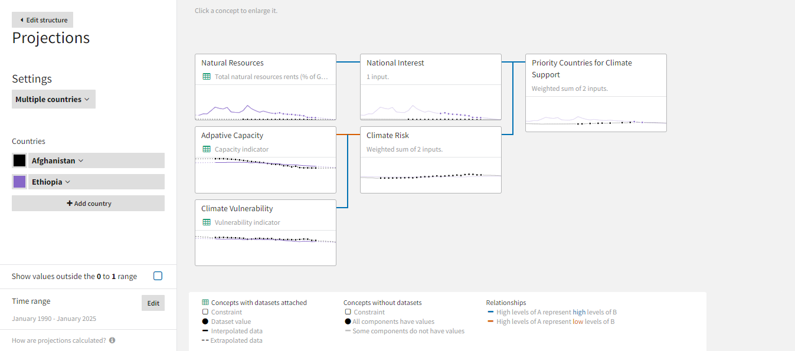
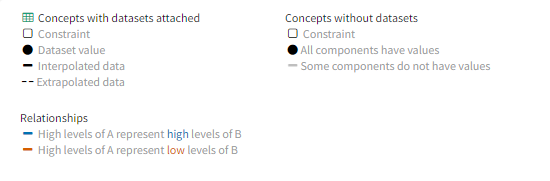

You can use the Projections view to understand recent and future trends in each of your model's datasets, concepts, and the overall priority. You can use it to compare countries or "what-if" scenarios.

??? list "To open the projections"

    * Click **View projections**.

## Understand projections

The projections for each concept draws on the datasets attached to them or their children.

- Projections for datasets are extrapolated (estimated beyond the range of historical values) and interpolated (estimated to fill in the gaps between historical values). 
- Projections for concepts without datasets are a weighted sum of their children.

??? info "How projections work in Causemos"

    To project a dataset into the future, Causemos produces various estimates of three components of the dataset's past behavior:
    
    + **Level**: Average overall behavior over the whole time period.
    + **Trend**: Long-term change (up or down) over time.
    + **Seasonality**: Repeating patterns that occur at regular intervals.
    
    The system then uses these estimates in many different combinations to create thousands of projections. The projection that best fits the past behavior of the dataset appears on the concept card.

    ### Learn more:

    To calculate the thousands of candidate projections, Causemos uses both of the following methods:

    - [Holt's linear trend method](https://otexts.com/fpp2/holt.html) :octicons-link-external-16:{ title="External link" alt="External link" }
    - [Holt-Winters seasonal method](https://otexts.com/fpp2/holt-winters.html) :octicons-link-external-16:{ title="External link" alt="External link" }

The legend below the projections shows whether the data comes directly from the dataset or is interpolated or extrapolated. Warnings on the dataset nodes indicate whether the datasets are outdated or insufficient for accurate projections.

??? list "To view projections in more detail"

    1. Click the concept node to expand it.
    2. Drag the handles on the timeline to zoom in or out on a period of interest.
    3. To close the detailed view, perform one of the following actions:
        - Click :fontawesome-solid-caret-left:{ aria-hidden="true" } **View all concepts** to return to the full graph.
        - Click a different concept node to expand it instead.

### Normalization

The y-axis for the projections is a normalization of the historical data for the concept, where 0 is the lowest value and 1 is the highest. 

Projections may be lower or higher than the historical data. You can adjust the y-axis to show the full extent of the project data. Reference lines on the expanded projection timeseries show the highs and lows of the historical data.

??? list "To show projections that are outside the historical highs and lows"

    - Click **Show values outside the 0 to 1 range**.

        

## Choose which countries to view

You can view projections for a single country or compare projections for more than one.

!!! note

    You can only compare scenarios when viewing projections for a single country.

??? list "To choose which countries to view"

    1. Click **Settings** and choose *Single country* or *Multiple countries*.
    2. Use the **Country** or **Countries** dropdown to choose the countries you want to view.
    3. To add more countries to the *Multiple countries* view, click :fontawesome-solid-circle-plus:{ aria-hidden="true"} **Add country** and repeat the previous step.

## Change the time range

You can change the time range displayed on all concept projections. The dates you can select are always at least 10 years before and 10 years after the earliest and most recent dates across all the datasets in your model.

??? list "To change the time range"

    1. In the Time range section, click **Edit**.
    2. Adjust the start and end dates and click **Done**.

## Add a scenario

With scenarios, you can place constraints (or "clamps") on datasets or concepts to see how downstream projections would change under different conditions. Each scenario has an automatically assigned color so you can differentiate them in the projections.

<figure markdown>
  
  <figcaption markdown>A scenario with constraints (:fontawesome-regular-square:{ aria-hidden="true" style="color: #8858e9;"}) added to a climate vulnerability concept. This scenario shows the effects of higher vulnerability on downstream projections and enables comparisons with the baseline.</figcaption>
</figure> 

!!! note

    You can only compare scenarios when viewing projections for a single country.

??? list "To create a scenario"

    1. Click :fontawesome-solid-plus:{ aria-hidden="true"} **Create new scenario**.
    2. Enter a unique name for the scenario.
    3. Click a node you want to add a constraint to.
    4. Click anywhere on the projection graph to add a constraint. Click directly above or below an existing data point to replace it with a constraint. To remove a constraint, click it again.
    5. Click **Done**.

??? list "To duplicate a scenario"

    1. Click :fontawesome-solid-ellipsis:{ alt="Options" title="Options" } > :material-content-copy:{ aria-hidden="true" } **Duplicate**.
    2. To rename the duplicated scenario, click :fontawesome-solid-ellipsis:{ alt="Options" title="Options" } > :fontawesome-solid-pencil:{ aria-hidden="true" } **Edit**, enter a unique name, and click **Done**.

??? list "To show or hide a scenario"

    * Click :fontawesome-regular-eye:{ alt="Show scenario" title="Show scenario" } / :fontawesome-regular-eye-slash:{ alt="Hide scenario" title="Hide scenario" }.

??? list "To delete a scenario"

    - Click :fontawesome-solid-ellipsis:{ alt="Options" title="Options" } > :fontawesome-solid-trash-can:{ aria-hidden="true"} **Delete**.