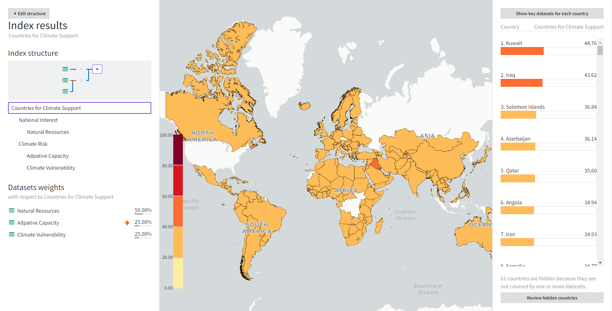
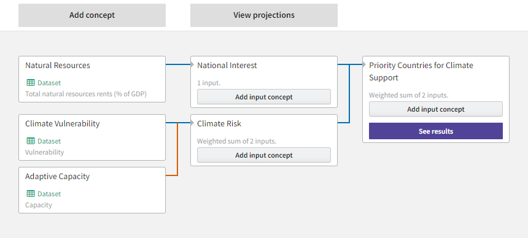
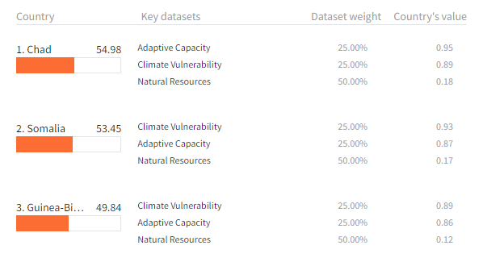

Once you've finished building your index, you can see how the various datasets and concepts combine to affect the rankings of the regions relative to your overall priority.

??? list "To open the region rankings"

    * Click **See results** on the overall priority.

## Understand dataset weights

Region rankings for your overall priority are based on a weighted sum of the concepts in your index. Each concept is a sum of its inputs, which are all weighed equally.

<figure markdown>
  
  <figcaption>The climate support index weighs both national interest and climate risk equally at 50%. The two concepts with datasets that feed into climate risk thus contribute 25% to the overall priority.
  </figcaption>
</figure>

The region ranking page shows your graph structure and dataset weights in the Index results panel. 

??? list "To review the weighting of the datasets in your index"

    1. Review the Index structure and Dataset weights in the Index results panel.
    2. Click :fontawesome-solid-caret-left:{ aria-hidden="true" } **Edit structure** to return to the graph and make changes if necessary.

## Understand region rankings

Each region rank is a weighted sum of the region's value in each dataset in your index. To enable comparisons across datasets, Causemos normalizes region values on a scale from 0&ndash;1, where 0 is low and 1 is high. The rank then is a sum of the products of the normalized values multiplied by their weights. 

Some countries may not be ranked at all. Causemos does not rank countries if they don't appear in one or more of the datasets in your index structure.

??? list "To explore region rankings on the map"

    1. Zoom and pan the map view to focus on the regions of interest:
        * To zoom in, scroll the mouse wheel, press ++plus++, or double click anywhere on the map.
        * To zoom out, scroll the mouse wheel or press ++minus++.
        * To move the map, press the arrow keys or click and drag anywhere on the map.
    2. Hover over a region to see its rank and overall score.

??? list "To see the normalized dataset values and weights that contribute to the rankings"

    1. Click **Show key datasets for each country**.
    2. If your analysis graph has more than three datasets, click **Show all x datasets** for any country that you're interested in.

??? list "To find that countries aren't ranked"

    * Click **Review hidden countries** to see a list of a countries and which of your datasets don't include them.

### Region ranking example

In a simple climate support index, Chad ranks first due to its high adaptive capacity and climate vulnerability.

Causemos determines its score (54.98) by:

1. Multiplying the region's normalized value in each dataset by the dataset's weight:

    | Dataset               | Normalized value | Dataset weight  | Weighted score |
    |-----------------------|-----------------:|----------------:|---------------:|
    | Adaptive capacity     | 0.9492           | 0.25            | 0.2373         |
    | Climate vulnerability | 0.8900           | 0.25            | 0.2225         |
    | Natural resources     | 0.1800           | 0.50            | 0.0900         |

    ??? note "Rounding of normalized values"

        The **Country's value** columns rounds the normalized values to two decimal places. For example, 0.9492 is displayed as 0.95. However in calculating each country's overall score, Causemos uses the precise, unrounded values.

2. Adding the weighted scores:

    `0.2373 + 0.2225 + 0.09 = 0.5498`

3. Multiplying the summed score by 100: 

    `0.5498 * 100 = 54.98`