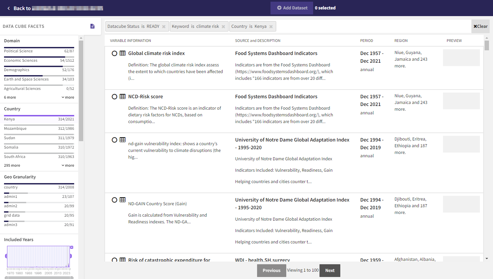

To attach a dataset to a concept when you can't find the right one in the automatic suggestions, you can perform an advanced search. The advanced search opens the datacube explorer, which lets you:

- Search specific fields (such as country, domain, and time) in the datasets,
- Filter the datasets based on common values in those fields, and
- View expanded descriptions of the datasets.

??? list "To open the datacube explorer"

    1. Add a new concept or click :fontawesome-solid-table-cells:{ aria-hidden="true" } **Attach dataset** on a concept that lacks data.
    2. Click **Use advanced search**.

## Add a datacube to a concept

Using the datacube explorer, you can search, filter, and review the available datasets for relevancy to the concepts in your index graph. Once you've identified a fit, you can select a dataset to add it to the concept you used to enter the explorer. 

??? list "To search for datacubes"

    1. Click in the search bar and select the field you want to search.
    2. Enter the keyword or value you want to search and press ++enter++. To add more keywords or values, repeat this step.
    3. Press ++enter++ again to submit your search.
    4. Review the facets to see a breakdown of the datacubes that match your search.
        <figure>
          
          <figcaption>The number of datasets in the search results that match each value. For example, there are 2,014 datasets that cover Ethiopia. Of these, 165 match the current search results.<figcaption>
        </figure>
    5. To view more details about a datacube, click anywhere on its card in the search results.

??? list "To filter a search"

    - Click a value in the Facets. For example, if you only want to see datacubes that contain data for Kenya, click **Kenya** in the Country facet.
        <figure>
          
          <figcaption>Added filters appear in the search bar. Click **x** any time to clear them.<figcaption>
        </figure>

??? list "To clear a search term or filter"

    - Perform one of the following actions:
        * Click :octicons-x-24:{ alt="Clear" title="Clear" } on the search badge above the results.
        * Click the filtered value again in the Facets.
        * Click :octicons-x-24:{ aria-hidden="true" } **Clear** in the search bar to remove all the search terms.

??? list "To add a datacube to the selected concept in your analysis"

    - Click :fontawesome-regular-circle:{ alt="Select" title="Select" } on a dataset to select it, and then click :fontawesome-solid-circle-plus:{ aria-hidden="true"} **Add Dataset**.